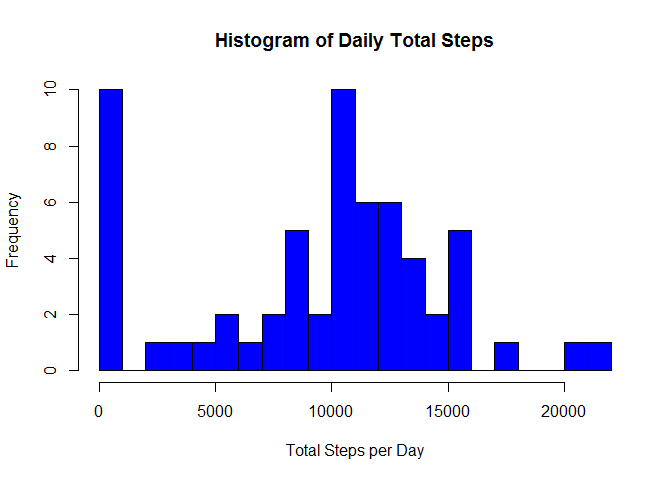
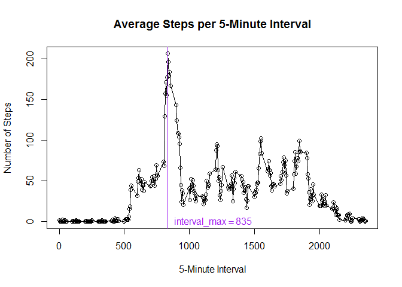
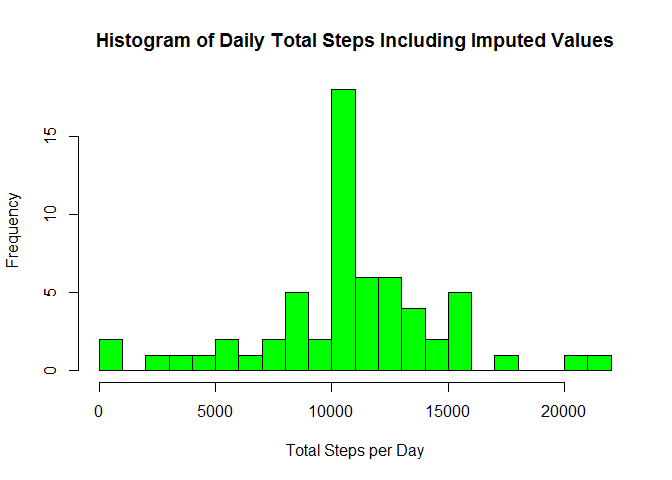
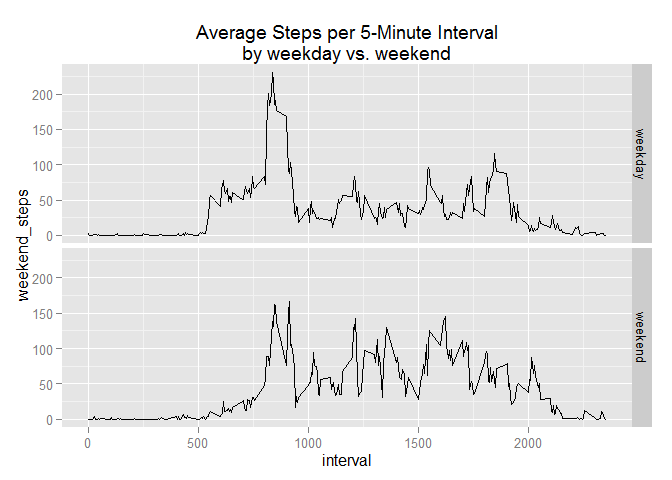

# Reproducible Research: Peer Assessment 1
David Beede  
`r Sys.Date()`  


## Loading and preprocessing the data
Data source: https://d396qusza40orc.cloudfront.net/repdata%2Fdata%2Factivity.zip

First, set the working directory:


```r
setwd(paste("C:/Users/Public/Documents/Dave/JHU_DataScience/",
        "ReproducibleResearch/RepData_PeerAssessment1_clone", sep=""))
```

Next, verify activity.csv file is in working directory and if not 
download and unzip it.  Then create summary file with total steps per day.


```r
if (!file.exists("activity.csv")) {
        temp <- tempfile()
        download.file(paste("https://d396qusza40orc.cloudfront.net/",
                "repdata%2Fdata%2Factivity.zip", sep=""), temp)
        unzip(temp, files = "activity.csv")
        ActMonitor <- read.csv("activity.csv")
} else {
        ActMonitor <- read.csv("activity.csv")
}
library(dplyr, warn.conflicts = FALSE)
by_date <- group_by(ActMonitor, date)
daily_steps_nas <- summarize(by_date, daily_steps = sum(steps, na.rm = TRUE))
```

## What is the mean total number of steps taken per day?
Make a histogram of total steps taken per day (ignoring missing values and
using 25 breaks to make the chart more readable)
and report mean and median number of daily steps:

```r
hist(daily_steps_nas$daily_steps, breaks = 25, 
        main = "Histogram of Daily Total Steps",
        xlab = "Total Steps per Day",
        col = "blue")
```

\

```r
summary(daily_steps_nas$daily_steps)
```

```
##    Min. 1st Qu.  Median    Mean 3rd Qu.    Max. 
##       0    6778   10400    9354   12810   21190
```

Using mean(daily_steps_nas&#36;daily_steps) and 
median(daily_steps_nas&#36;daily_steps), I found that the mean number of 
steps per day is 9354
and the median is 10395.  (I don't know why 
summary() and median() generate different values.)

## What is the average daily activity pattern?
Create a time series plot of average number of steps per five minute interval

```r
by_interval <- group_by(ActMonitor, interval)
interval_steps_nas <- summarize(by_interval, 
        interval_steps = mean(steps, na.rm = TRUE))

#identify 5-minute interval with maximum average number of steps
max_interval_steps <- filter(interval_steps_nas, 
        interval_steps == max(interval_steps))
interval_max <- max_interval_steps$interval
eq <- bquote(interval_max == .(interval_max))

#create time series plot showing interval with maximum average steps
with(interval_steps_nas, plot(interval, interval_steps, 
        xlab = "5-Minute Interval", ylab = "Number of Steps"))
title(main = "Average Steps per 5-Minute Interval")
lines(interval_steps_nas$interval, interval_steps_nas$interval_steps, type="l")
abline(v=interval_max, col="purple")
text(interval_max+350, 0, eq, col = "purple")
```

\

The 5-minute interval that contains the maximum number of steps on average
across all days is 835.

## Imputing missing values

```r
steps_na <- is.na(ActMonitor$steps)
num_steps_na <- sum(steps_na)
```
The number of missing steps values is 2304.

The strategy for imputing values for missing step values is to use the average 
(across days) number of steps for each interval (calculated above).  

```r
ActMonitorImpute <- merge(ActMonitor, interval_steps_nas, all = TRUE)
ActMonitorImpute <- mutate(ActMonitorImpute, imputed_steps = steps)
index <- is.na(ActMonitorImpute$steps)
ActMonitorImpute$imputed_steps[index] <- ActMonitorImpute$interval_steps[index]
by_date <- group_by(ActMonitorImpute, date)
daily_steps_imputed <- summarize(by_date, daily_steps_imp = sum(imputed_steps))
hist(daily_steps_imputed$daily_steps_imp, breaks = 25, 
        main = "Histogram of Daily Total Steps Including Imputed Values",
        xlab = "Total Steps per Day",
        col = "green")
```

\

```r
summary(daily_steps_imputed$daily_steps_imp)
```

```
##    Min. 1st Qu.  Median    Mean 3rd Qu.    Max. 
##      41    9819   10770   10770   12810   21190
```

Using the full dataset but with missing values of steps replaced by 
imputed values, I found that the revised mean number of steps per day is 
 10766 
and the revised median is 
 10766. (As in the 
non-imputed case, I don't know why summary(), mean(), and median() generate 
slightly different values.)  The revised (imputed) mean and median estimates 
are larger than the original estimates, suggesting the pattern of intervals 
with relatively more NA's is not random; further analysis should be done to see 
the time pattern of NAs.

## Are there differences in activity patterns between weekdays and weekends?
Create a factor variable for weekend days and weekday days and create a panel plot
containing time series plots of average imputed steps for each 5-minute interval
by weekend (Saturdays and Sundays) and weekday days.

```r
ActMonitorImpute$weekdate <- weekdays(as.Date(ActMonitorImpute$date))
ActMonitorImpute$weekend <- (ActMonitorImpute$weekdate == "Saturday" 
          | ActMonitorImpute$weekdate == "Sunday")
ActMonitorImpute$weekend <- factor(ActMonitorImpute$weekend, 
        labels=c("weekday", "weekend"))
by_weekend_interval <- group_by(ActMonitorImpute, weekend, interval)
weekend_intervalsteps <- summarize(by_weekend_interval, 
        weekend_steps = mean(imputed_steps))
library("ggplot2")
p <- ggplot(weekend_intervalsteps, 
        aes(x=interval, y=weekend_steps)) + geom_line()
p <- p + facet_grid(weekend ~ .)
p <- p + ggtitle("Average Steps per 5-Minute Interval\nby weekday vs. weekend")
print(p)
```

\

Steps appear to be more evenly spread across waking hours on weekends compared
to weekdays.  This may be because on weekdays a lot of steps occur during 
morning commuting times (about 8:00-9:00AM), but this individual is relatively 
sedentary during regular work hours (and more active during the day on 
weekends).
